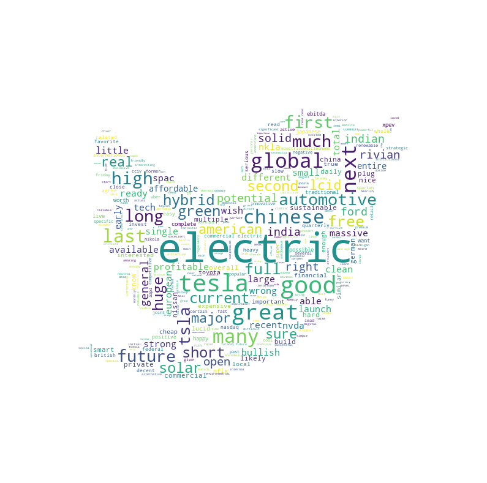

# Electric Vehicle Sentiment Trading

For anyone who follows the stock market, you’ve probably come across the term “memestock.” A meme stock is a stock that has gone viral online, drawing the attention of retailinvestors. Meme stocks have become increasingly popular over the past 18-months, while retail investors were stuck at home during the pandemic and provided free trading dollars through government stimulus checks. The term “meme stock” made massive media headlines when the popular meme stock GameStop skyrocketed in price in a David vs. Goliath like narrative.A meme stock typically has an increase in volume not because of the company’s performance, but rather because of hype on social media and online forums like Twitter or Reddit. Meme stocks are not a class of investments that’s covered in a textbook.Meme stocks rise in popularity because of conversations held online over various platforms. Due to internet hype going viral, meme stocks tend to see rapid price spikes. The increased price is mostly artificial and not the result of the company’s actual fundamental performance.The rise of retail investors was born through the meme stock hype, along with zero transaction fees offered by brokerages and through new stock trading apps, such as Robinhood. The Robinhood app was downloaded more than 1 million times in the last week of January, as the retail craze took hold.Because of this new phenomenon created by retail investors, it’s the early adopters whoreally profit from these trending stocks. Once the meme stock cycle enters the FOMO phase, it’s likely too late to make a profit. 

The goal of Group 3’s project was to analyze twitter sentiment amongst various tweets to determine if there was a way to predict stock price movement. Since Elon Musk has been investigated by the SEC for tweets associated with Tesla stock price movement, we attempted to determine if there was a way to analyze EV tweet sentiment and predict Tesla stock price movement.

This Project was done using Natural Language Processing (NLP) Techniques . Python libraries like Pandas (for Data Cleaning/Manipulation), Tweepy (for Tweets Mining), NLTK (Natural Language Toolkit), TextBlob (for Sentiment Analysis), MatPlotlib & WordCloud (for Data Exploration), Emot (for Emojis identification), Plotly (for some Data Visualisation) were used for this project.

In the Jupyter Notebook, we carried out the following steps for the project:

Import Libraries
Tweets Mining
Data Cleaning
Tweets Processing
Sentiment Analysis
Classification 
RandomForestRegressor

To reach the ultimate goal, there was a need to clean up the individual tweets. To make this easy, we created a function "preProcessTweets" in my Python program which we further applied to the "Tweets" to produce the desired results. This user-defined function was used to remove punctuations, links, emojis, and stop words from the tweets in a single run. Additionally, we used a concept known as "Tokenization" in NLP. It is a method of splitting a sentence into smaller units called "tokens" to remove unnecessary elements. Another technique worthy of mention is "Lemmatization". This is a process of returning words to their "base" form. 

To get the most common words used to describe "Electric Vehicle", we used the POS-tag (Parts of Speech tagging) module in the NLTK library. Using the WordCloud library, one can generate a Word Cloud based on word frequency and superimpose these words on any image. We used the Twitter logo and Matplotlib to display the image. The Word Cloud shows the words with higher frequency in bigger text size while the "not-so" common words are in smaller text sizes.

For this analysis, we used Vedar and TextBlob. Text Blob analyzes sentences by giving each tweet a Subjectivity and Polarity score.  Based on the Polarity scores, one can define which tweets were Positive, Negative, or Neutral. A Polarity score of < 0 is Negative, 0 is Neutral while > 0 is Positive. 

Some of the insights we generated are stated below:

Tweet Sentiments: we were not surprised by the proportion of the sentiment categories because, for most people, the prime electric vehicle company to talk about was TESLA. However, we found minimum level of mixed attitude towards the electric vehicle, hence, 12.5% of the tweets being Negative. 

From the tweets we found the one of the most frequent two words that come is "Elon Mask". we also found people are very much interested on Marcedeze Bench movement towards electric vehicle. 

The sentence tone analyzer indicates that most of the people are rather analytical when it comes to EV market and they are excited and joyful also. 

We believe there is a definite correlation between tweet sentiment and stock price movement of Tesla. We can begin to develop a pattern between sentiment and trading volume, although we cannot accurately predict Tesla stock price at this time of the project

Unfortunately, we have concluded we need to analyze a lot more data in order to prove this thesis, although we begin to see some patterns in trading volume based on tweet sentiment of Tesla.Twitter will only allow several thousand tweets to be analyzed from it’s free API before we get blocked and we believe hundreds of thousands, if not millions of tweets need to be analyzed. We think Tesla may have been too large of a company to analyze as a meme stock, as Elon Musk might be the only twitter account to really move Tesla stock. Especially since this is a $700B market cap company and heavily invested in amongst institutional investors. As we continue to build on this project, we would try to look at smaller meme stocks and the twitter sentiment to see if retail investors are moving the stock price and try to help investors get ahead of the FOMO phase, before it’salready too late to make a profit.  